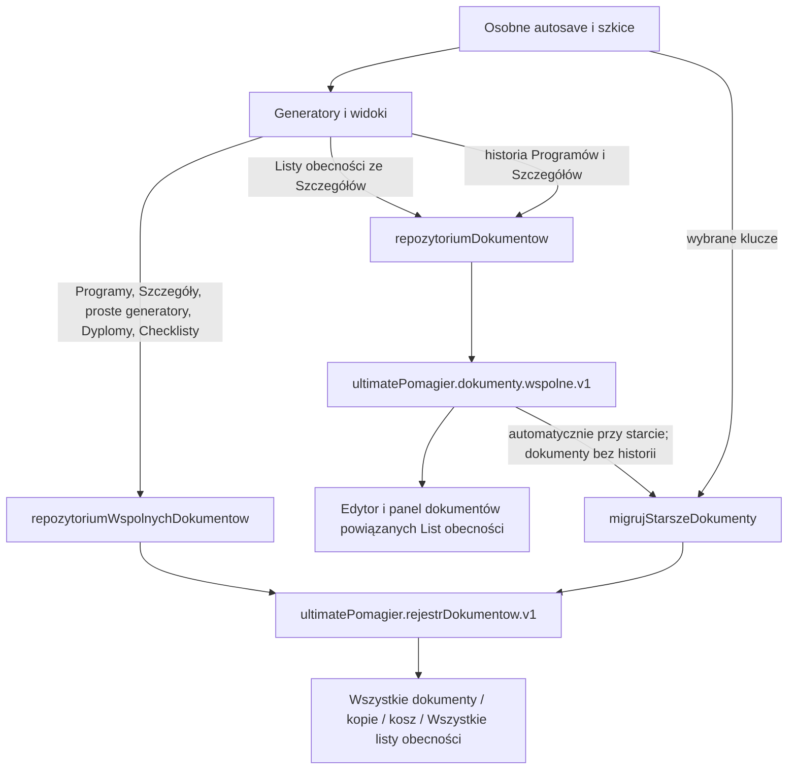

# Audyt magazynów danych i plan migracji do jednego źródła prawdy

Data audytu: 2026-08-25

Repozytorium: `Ultimate_Pomagier_3_5`

Commit bazowy: `2efdac7ec81eb98a63fe82e4eff3cbecdaa5afb1` (`main`, zgodny z `origin/main` po `git fetch origin`)

Zakres: wyłącznie analiza kodu i plan. Nie zmieniono logiki produkcyjnej, nie uruchomiono migracji danych i nie usunięto żadnego magazynu.

## 1. Executive summary

Obecnie nie istnieje jedno źródło prawdy dla danych dokumentowych. Aktywnie używane są co najmniej dwa repozytoria:

- docelowy `repozytoriumWspolnychDokumentow`, klucz `ultimatePomagier.rejestrDokumentow.v1`, schemat wewnętrzny w wersji `2`;
- starszy `repozytoriumDokumentow`, klucz `ultimatePomagier.dokumenty.wspolne.v1`, zawierający dokumenty i osobną tablicę historii.

Ponadto autosave, bieżące szkice i wskaźniki aktywnych dokumentów są zapisane w osobnych kluczach `localStorage`. Nie znaleziono użycia `sessionStorage`, IndexedDB, Cache Storage ani cookies jako magazynu aplikacji. Zmienne dane trwałe są przechowywane wyłącznie w `localStorage`; repozytorium zawiera też statyczne dane startowe.

Najpoważniejsze wnioski:

1. **Lista obecności utworzona ze Szczegółów organizacyjnych może istnieć i nie być widoczna w „Wszystkie listy obecności”.** Generator zapisuje ją do starego repozytorium, a lista globalna czyta wyłącznie nowy rejestr.
2. Obecna migracja `migrujStarszeDokumenty()` jest uruchamiana automatycznie przy starcie układu aplikacji (`UkladAplikacji.tsx:277-279`), wbrew wymaganiu przyszłej migracji ręcznej.
3. Migracja dokumentów ze starego repozytorium **nie jest idempotentna**: przy pierwszym uruchomieniu zachowuje wolne ID, a przy drugim widzi to ID jako kolizję i może utworzyć drugi rekord z ID `typ-migracja-id` (`migracjaStarszychDokumentow.ts:134-143`).
4. Obecna migracja nie przenosi tablicy `historia` starego repozytorium, nie zachowuje poprawnie kosza, oryginalnej daty publikacji, widoczności, źródła, formatu ani pełnych powiązań.
5. Nowy rejestr nie ma pełnego dziennika historii. Przechowuje bieżące dokumenty i techniczną kolekcję `kopieRobocze`; „historia wersji” jest wyliczana z osobnych dokumentów po `dokumentNadrzednyId`, więc nie obejmuje aktualizacji w miejscu. Pełne migawki Programów szkoleń i historia Szczegółów organizacyjnych nadal istnieją tylko w starym repozytorium.
6. Leniwy import starego klucza opublikowanych Szczegółów jest wykonywany przy każdym odczycie i aktualizuje rekord o tym samym ID w nowym rejestrze. Stary zapis może więc ponownie nadpisać nowszy stan (`magazynWersjiRoboczych.ts:74-80`, `161-167`, `45-71`).
7. Obecny eksport „pełnej kopii JSON” obejmuje wszystkie klucze bieżącego originu `localStorage`, ale nie ma manifestu, sum kontrolnych, walidacji ani mechanizmu pełnego przywracania. Nie jest automatycznie powiązany z migracją.

Rekomendacja: rozwinąć obecny wspólny rejestr do schematu `v3`, dodać do niego pełną historię, autosave i metadane migracyjne, a następnie wykonać ręczną, dwufazową migrację z backupem, walidacją i atomowym przełączeniem zapisów. Stary magazyn należy zachować jako niezmieniane źródło awaryjne do czasu osobno zatwierdzonego usunięcia.

## 2. Stan repozytorium przed audytem

- `git fetch origin`: zakończony powodzeniem.
- gałąź: `main`;
- HEAD: `2efdac7ec81eb98a63fe82e4eff3cbecdaa5afb1`;
- status początkowy: `## main...origin/main`, bez zmian w working tree;
- worktree: jeden, bieżący katalog na `main`;
- lokalne branche: `main`, `codex/plan-dnia-24h`, `etap-4c/domkniecie-dynamicznych-pol-i-walidacji`, `fix/walidacja-sekcji-i-porownanie-wersji`;
- zdalne branche etapów dokumentowych 5A-5G są widoczne, ale audyt dotyczy kodu aktualnego `main`.

W repozytorium nie znaleziono pliku `AGENTS.md`; zastosowano instrukcje przekazane wraz z zadaniem.

## 3. Inwentaryzacja magazynów i wszystkich kluczy storage

### 3.1. Dane dokumentowe

| Klucz `localStorage` | Moduł / typ danych | Zapisuje | Odczytuje | Stan i dublowanie |
| --- | --- | --- | --- | --- |
| `ultimatePomagier.rejestrDokumentow.v1` | `src/wspolne/dokumenty/rejestrDokumentow.ts`; `{ wersja, dokumenty, kopieRobocze }` | wspólny rejestr, generatory korzystające z adapterów, migracja | globalne listy, Programy, Szczegóły, Checklisty, adaptery zapisu | **Aktywny, docelowy**. Dubluje część starego repozytorium i osobne szkice. Nazwa klucza ma `v1`, a schemat wewnętrzny ma wersję `2`. |
| `ultimatePomagier.rejestrDokumentow.kopia-bezpieczenstwa` | surowa kopia rejestru sprzed migracji jego schematu | `rejestrDokumentow.ts:131-136` | brak czytnika | Aktywny wyłącznie przy zmianie schematu; jedna nadpisywana kopia, brak restore. Nie zabezpiecza transferu ze starego repozytorium. |
| `ultimatePomagier.dokumenty.wspolne.v1` | `src/wspolne/dokumenty/repozytoriumDokumentow.ts`; `{ dokumenty, historia }` dla Programów, Szczegółów i List obecności | aktywnie: Listy obecności oraz historia Programów i Szczegółów; potencjalnie stary magazyn kopii | te same moduły i migracja startowa | **Aktywny, stary**. Dubluje rekordy nowego rejestru; zawiera historię, której nowy rejestr nie posiada. |
| `ultimatePomagier.dokumenty.historiaEksportow.v1` | metadane eksportów PDF/DOCX | `zarejestrujEksportDokumentu` w `wersjonowanieDokumentow.ts` | `pobierzHistorieEksportow` | Mechanizm istnieje, ale nie ma wywołań produkcyjnych poza samym modułem. Osobny dziennik dokumentowy do włączenia do v3. |
| `ultimatePomagier.kopieRobocze` | stara tablica wspólnych kopii Programów/Szczegółów | brak bieżącego writera | `magazynKopiiRoboczych.ts`, migracja dokumentów | Legacy. Moduł ogólny nie ma produkcyjnego importu wartościowego; Programy importują z niego wyłącznie typ. Dubluje kopie w obu repozytoriach. |
| `ultimate-pomagier-program-szkolenia-roboczy` | stary pojedynczy autosave Programu | brak bieżącego writera | fallback `pobierzStarszyAutosaveProgramu`, usuwanie po jawnym zapisie | Legacy, nadal aktywnie odczytywany. |
| `ultimatePomagier.programySzkolen.autosave.v1` | niezależny autosave Programu: sesja, aktywne ID, pełne dane | `WidokProgramowSzkolen` przez `zapiszAutosaveProgramu` | ten sam widok | **Aktywny**. Nie pojawia się na liście, ale dubluje bieżący stan formularza poza rejestrem. |
| `ultimatePomagier.programySzkolen.aktywnaKopiaRobocza` | wskaźnik ID otwartego Programu | magazyn Programów i nawigacja | magazyn Programów / widok | **Aktywny wskaźnik UI**, nie sam dokument. |
| `ultimatePomagier.programySzkolen.kopieRobocze.wspolnyMagazyn.v1` | znacznik „migracji” aktywnej kopii | `ustawAktywnaKopieProgramu` | brak czytnika | Aktywny zapis, ale write-only; nie potwierdza migracji danych. |
| `ultimatePomagier.szczegolyOrganizacyjne.aktualnaWersja` | pełna aktywna wersja robocza Szczegółów | `ustawAktualnaWersjeRobocza` | generator i listy kopii | **Aktywny**. Dubluje dokument roboczy z nowego rejestru i pełni rolę wskaźnika oraz kopii danych naraz. |
| `ultimatePomagier.szczegolyOrganizacyjne.opublikowane` | stara tablica opublikowanych Szczegółów | brak bieżącego writera | leniwy importer `zmigrujStarszeOpublikowaneSzczegoly` | Legacy, lecz aktywnie odczytywany przy każdym pobraniu opublikowanych. Może nadpisywać nowszy rekord w nowym rejestrze. |
| `ultimatePomagier.szczegolyOrganizacyjne.autosave` | pełny autosave Szczegółów | hook generatora | hook generatora | **Aktywny**, osobny od rejestru. |
| `ultimatePomagier.szczegolyOrganizacyjne.historia` | stara historia Szczegółów | brak bieżącego writera | leniwy importer do starego repozytorium | Legacy; po imporcie dubluje historię w `ultimatePomagier.dokumenty.wspolne.v1`. |
| `ultimatePomagier.szczegolyOrganizacyjne.kopieRobocze` | starsza tablica kopii Szczegółów | brak bieżącego writera | tylko migracja dokumentów | Legacy. |
| `ultimate-pomagier.listy-obecnosci.szkic` | tekst pojedynczego szkicu prostego generatora | `ProstyGeneratorDokumentu`, nawigacja przy otwieraniu | prosty generator i migracja | **Aktywny**. Dubluje `daneDokumentu.tekst` w nowym rejestrze. Nie obejmuje List tworzonych ze Szczegółów. |
| `ultimate-pomagier.listy-obecnosci.szkic.dokumentId` | ID rekordu prostego generatora | prosty generator / nawigacja | prosty generator | **Aktywny wskaźnik**. |
| `ultimate-pomagier.ankiety.szkic` | tekst szkicu Ankiety | `ProstyGeneratorDokumentu`, nawigacja | prosty generator i migracja | **Aktywny**, dubluje nowy rejestr. |
| `ultimate-pomagier.ankiety.szkic.dokumentId` | ID Ankiety | prosty generator / nawigacja | prosty generator | **Aktywny wskaźnik**. |
| `ultimate-pomagier.karta-na-drzwi.szkic` | tekst szkicu Karty na drzwi | `ProstyGeneratorDokumentu`, nawigacja | prosty generator i migracja | **Aktywny**, dubluje nowy rejestr. |
| `ultimate-pomagier.karta-na-drzwi.szkic.dokumentId` | ID Karty na drzwi | prosty generator / nawigacja | prosty generator | **Aktywny wskaźnik**. |
| `ultimate-pomagier.dyplomy.generator-pawla` | pełny bieżący stan Certyfikatu/Zaświadczenia/Dyplomu | autosave efektu widoku, jawny zapis, nawigacja | widok Dyplomów i migracja | **Aktywny**. Dubluje dane jawnie zapisanego dokumentu w nowym rejestrze. |
| `ultimate-pomagier.dyplomy.generator-pawla.dokumentId` | ID aktywnego dokumentu dyplomowego | widok / nawigacja | widok | **Aktywny wskaźnik**. Czyszczenie generatora nie usuwa tego ID. |
| `ultimate-pomagier.log-wymuszen-eksportu` | dziennik wymuszonego eksportu Programów | `WidokProgramowSzkolen.tsx:1062-1077` | ten sam zapis przed dopisaniem | **Aktywny warunkowo**, osobny dziennik dokumentowy. |
| `ultimatePomagier.migracjaDokumentow.kopia.<klucz-zrodlowy>` | surowe kopie wybranych legacy kluczy | `migracjaStarszychDokumentow.ts` | brak czytnika | Mechanizm aktywny podczas automatycznej migracji, ale nie obejmuje starego repozytorium, jego historii, opublikowanych Szczegółów ani autosave. Brak restore. |

Konkretne klucze tworzone przez ostatni prefiks odpowiadają źródłom: trzy proste szkice, bieżący stan Dyplomów, `szczegolyOrganizacyjne.kopieRobocze`, `szczegolyOrganizacyjne.aktualnaWersja` i `ultimatePomagier.kopieRobocze`.

### 3.2. Dane niedokumentowe

| Klucz `localStorage` | Moduł / typ danych | Aktywność i uwagi |
| --- | --- | --- |
| `ultimatePomagier.uzytkownicy.v1` | `kartoteki/uzytkownicy/magazynUzytkownikow.ts`; profile, role, organizacje, odznaki, status, kontakty i wersja uprawnień | **Aktywny**, inicjalizowany i migrowany z danych startowych. |
| `ultimatePomagier.sesjaUzytkownika.v1` | `aplikacja/logowanie/sesjaUzytkownika.ts`; ID użytkownika, wersja uprawnień, data | **Aktywny**. |
| `ultimate-pomagier.zalogowany-uzytkownik` | stara pełna sesja | Migrowany i usuwany przez `sesjaUzytkownika.ts`, ale nadal bezpośrednio czytany przez Kartotekę szablonów i Replikator. |
| `ultimate-pomagier.aktywna-rola` | stara aktywna rola | Usuwany przy migracji sesji, ale nadal czytany przez Replikator. |
| `ultimate-pomagier-rola-uzytkownika` | starsza rola do wymuszonego eksportu Programu | Aktywny read-only; brak bieżącego writera. |
| `rolaUzytkownika` | jeszcze starszy fallback roli | Aktywny read-only; brak bieżącego writera. |
| `ultimate-pomagier.kartoteki.trenerzy` | `WidokKartotek.tsx`; trenerzy | **Aktywny**; czytany też przez Dyplomy i Szczegóły. |
| `ultimate-pomagier.kartoteki.klienci` | `WidokKartotek.tsx`; klienci | **Aktywny**. |
| `ultimate-pomagier.kartoteki.lokalizacje` | `magazynLokalizacji.ts`; tylko zmiany użytkownika względem CSV | **Aktywny**; scalany ze statycznym CSV. |
| `ultimate-pomagier.kartoteki.szablony-dokumentow` | `magazynSzablonowDokumentow.ts`; szablony, model blokowy, raporty, decyzje i historia wersji | **Aktywny, niezależna kartoteka**. Szablon nie jest instancją dokumentu biznesowego i nie powinien być automatycznie migrowany jako `Dokument`. |
| `ultimatePomagier.pulpit.v1` | `magazynPulpitu.ts`; zadania ręczne, wysłane paczki, zapotrzebowania zakupowe | **Aktywny**. Automatyczne zadania są wyliczane, a ręczne utrwalane. |
| `ultimatePomagier.ustawieniaAplikacji.v1` | centralne ustawienia wyglądu, nawigacji, Pulpitu, zadań i dostępności | **Aktywny**. |
| `ultimatePomagier.menuPrzypiete` | preferencja menu | **Aktywny**. |
| `ultimatePomagier.menuWysuwanieZKrawedzi` | preferencja menu | **Aktywny**. |
| `ultimatePomagier.menuDrzewo.v1.<uzytkownikId>` | tryb i rozwinięte pozycje menu per użytkownik | **Aktywny klucz dynamiczny**; także wariant `.anonim`. |
| `ultimatePomagier.panelJakosciPrzypiety` | preferencja prawego panelu | **Aktywny**, wspólna dla Ustawień i Szczegółów. |
| `ultimatePomagier.panelJakosciWysuwanieZKrawedzi` | preferencja prawego panelu | **Aktywny**. |
| `ultimate-pomagier.dyplomy.panel-ustawien-przypiety` | preferencja panelu Dyplomów | **Aktywny**. |
| `ultimate-pomagier.dyplomy.panel-ustawien-wysuwanie` | preferencja panelu Dyplomów | **Aktywny**. |
| `ultimate-pomagier-aktywny-widok` | ostatni widok nawigacji | Aktywnie zapisywany (`UkladAplikacji.tsx:433-439`), lecz nie jest używany przy ustalaniu widoku początkowego. |

### 3.3. Statyczne źródła danych

- użytkownicy startowi: `src/kartoteki/uzytkownicy/daneUzytkownikow.ts`;
- trenerzy startowi: `src/moduly/zamkniete/szczegoly_organizacyjne/trenerzyKartoteki.ts`;
- klient startowy: `src/kartoteki/WidokKartotek.tsx`;
- lokalizacje startowe: `src/kartoteki/lokalizacje/dane/kartoteka_lokalizacje_miejscowosci_2019.csv`;
- presety Programów: `src/moduly/dokumenty/generatory/programy_szkolen/presetyProgramu.ts`.

Są to dane wersjonowane z kodem. Nie są drugim mutowalnym magazynem dokumentów, ale wpływają na inicjalizację i normalizację lokalnych kartotek.

## 4. Przepływ danych dokumentowych



Kluczowy problem: strzałki zapisu i listowania List obecności kończą się w różnych magazynach. Automatyczna migracja startowa nie jest replikacją bieżącą i nie zapewnia spójności po kolejnych edycjach.

## 5. Wszystkie runtime'owe użycia starego repozytorium

### 5.1. Aktywne w aplikacji

| Plik | Operacje | Rola runtime |
| --- | --- | --- |
| `src/wspolne/dokumenty/migracjaStarszychDokumentow.ts` | `pobierz()` | Czyta dokumenty starego repozytorium podczas automatycznej migracji startowej. Nie czyta `historia`. |
| `src/moduly/dokumenty/generatory/programy_szkolen/magazynKopiiRoboczychProgramu.ts` | `dodajWersjeHistorii()`, `pobierzHistorie()` | Każdy jawny zapis Programu zapisuje pełną migawkę historii w starym repozytorium. Dokument bieżący jest w nowym. Czytnik historii nie jest obecnie podłączony do widoku, ale jest częścią runtime modułu i testów. |
| `src/moduly/zamkniete/szczegoly_organizacyjne/uslugi/magazynWersjiRoboczych.ts` | `pobierzHistorie()`, `dodajWersjeHistorii()` | Historia wersji, statusów, importów i zdarzeń Szczegółów pozostaje w starym repozytorium. Stary osobny klucz historii jest do niego leniwie importowany. |
| `src/moduly/dokumenty/generatory/listy_obecnosci/rejestrListObecnosci.ts` | `pobierzPoId()`, `pobierz()`, `zapiszNowy()`, `aktualizuj()` | Pełny aktywny cykl List obecności tworzonych ze Szczegółów: wykrywanie duplikatu, utworzenie, lista powiązanych, otwarcie i ręczne korekty. |

Aktywne ścieżki pośrednie starego repozytorium:

- `PanelTworzeniaListObecnosci.tsx` → `utworzListeObecnosciZeSzczegolow()` → `repozytoriumDokumentow.zapiszNowy()`;
- `WidokListyObecnosciZDokumentu.tsx` → `pobierzListeObecnosciPoId()` / `zapiszKorektyListyObecnosci()` → stare repozytorium;
- `PanelDokumentowPowiazanych.tsx` → `pobierzListyObecnosciPowiazane()` → stare repozytorium;
- `WidokProgramowSzkolen.tsx` → `zapiszJawnaKopieProgramu()` → dokument w nowym rejestrze oraz migawka historii w starym;
- hook i widoki Szczegółów → `pobierzHistorieSzczegolow()` / `dodajWpisHistoriiSzczegolow()` → stare repozytorium.

### 5.2. Kod istniejący, lecz bez produkcyjnej ścieżki wartościowej

`src/wspolne/dokumenty/magazynKopiiRoboczych.ts` używa starego repozytorium do migracji `ultimatePomagier.kopieRobocze`, listowania, zapisu i przenoszenia kopii do kosza. W kodzie produkcyjnym inne moduły importują z niego tylko typ `KopiaRobocza`; nie znaleziono runtime'owego wywołania jego funkcji. Funkcje są używane w testach. Przed wyłączeniem starego repozytorium moduł trzeba usunąć albo przepisać, aby nie pozostała ukryta droga ponownego użycia.

## 6. Wszystkie runtime'owe użycia nowego repozytorium

| Plik | Operacje / odpowiedzialność |
| --- | --- |
| `src/wspolne/dokumenty/rejestrDokumentow.ts` | definicja rejestru: odczyt, utworzenie, aktualizacja, archiwum, kosz, trwałe usunięcie, techniczne kopie robocze, znacznik świeżości źródła |
| `src/wspolne/dokumenty/zapisDokumentuGeneratora.ts` | wspólny zapis/aktualizacja prostych generatorów, Dyplomów i Szczegółów |
| `src/wspolne/dokumenty/wersjonowanieDokumentow.ts` | publikacja, tworzenie aktualizacji jako nowego dokumentu wersji, wyliczanie rodziny wersji, metadane eksportów |
| `src/wspolne/dokumenty/migracjaStarszychDokumentow.ts` | zapis dokumentów przenoszonych z legacy źródeł |
| `src/moduly/dokumenty/ListaDokumentow.tsx` | jedyne źródło dla globalnych list, list typowanych, archiwum, kosza, publikacji i trwałego usuwania |
| `src/moduly/dokumenty/generatory/programy_szkolen/rejestrProgramowSzkolen.ts` | odczyt, jawny zapis, nowe kopie i miękkie usuwanie Programów |
| `src/moduly/zamkniete/szczegoly_organizacyjne/uslugi/magazynWersjiRoboczych.ts` | kopie robocze i opublikowany bieżący rekord Szczegółów; publikacja aktualizuje rekord w miejscu |
| `src/moduly/dokumenty/generatory/checklisty_paczek/rejestrChecklistPaczek.ts` | pełny aktywny zapis, statusy, archiwizacja i miękkie usuwanie Checklist paczek |

Pośrednio z nowego repozytorium korzystają:

- `ProstyGeneratorDokumentu.tsx`: Listy obecności tworzone ręcznie jako tekst, Ankiety i Karty na drzwi;
- `WidokDyplomow.tsx`: jawny zapis Certyfikatów, Zaświadczeń i Dyplomów;
- wszystkie warianty `WidokWszystkichDokumentow` i `WidokKopiiRoboczychDokumentow`.

## 7. Konflikty, niewidoczność i ryzyko utraty danych

### 7.1. Potwierdzona niewidoczność List obecności

Ścieżka zapisu:

1. `PanelTworzeniaListObecnosci.tsx:75-121` wywołuje `utworzListeObecnosciZeSzczegolow()`.
2. `rejestrListObecnosci.ts:82-117` zapisuje rekord przez `repozytoriumDokumentow.zapiszNowy()` do `ultimatePomagier.dokumenty.wspolne.v1`.
3. Panel powiązanych dokumentów oraz edytor nadal czytają ten stary rekord (`rejestrListObecnosci.ts:55-76`, `WidokListyObecnosciZDokumentu.tsx`).

Ścieżka globalnej listy:

1. `UkladAplikacji.tsx:197-200` renderuje „Wszystkie listy obecności” jako `WidokWszystkichDokumentow` z typem `LISTA_OBECNOSCI`.
2. `ListaDokumentow.tsx:53-65` ładuje wyłącznie `repozytoriumWspolnychDokumentow.pobierzWszystkie()`.

Skutek: po utworzeniu Listy ze Szczegółów dokument działa w panelu powiązanym i edytorze, ale nie pojawia się na właściwej liście globalnej. Automatyczna migracja jest wywoływana tylko raz przy montowaniu `UkladAplikacji`, więc dokument utworzony później nie jest kopiowany do nowego rejestru do następnego startu aplikacji.

Po ponownym uruchomieniu może powstać cień dokumentu w nowym rejestrze, lecz dalsze ręczne korekty zapisują wyłącznie stary rekord. Kolejne uruchomienie migracji pomija istniejące docelowe ID, dlatego globalna lista może pokazywać nieaktualny tytuł i dane. Publikacja/archiwizacja/kosz z listy globalnej zmienia wtedy tylko nowy cień, a edytor nadal modyfikuje stary rekord.

### 7.2. Automatyczna migracja i duplikaty

`UkladAplikacji.tsx:277-279` uruchamia `migrujStarszeDokumenty()` automatycznie. Dla starego rekordu:

- pierwsze uruchomienie, przy wolnym ID: tworzy dokument z oryginalnym ID;
- drugie uruchomienie: oryginalne ID już istnieje, więc kod wybiera `typ-migracja-id`; to ID jeszcze nie istnieje, więc tworzy duplikat;
- dopiero następne uruchomienia pomijają drugi rekord.

Istniejący test idempotencji obejmuje tylko prosty szkic o stałym ID, nie obejmuje dokumentów `repozytoriumDokumentow`. Co więcej, `testy/migracjaStarszychDokumentow.test.ts` nie jest dołączony do skryptu `npm test`.

### 7.3. Niepełne mapowanie starego cyklu życia

`pobierzStatus()` mapuje `opublikowany` i `archiwalny`, lecz `kosz` staje się `ROBOCZY`. Migracja nie ustawia `czyUsunietyMiekko` ani `usunieto`. Dodatkowo:

- `opublikowano` jest wyliczane z `zaktualizowano`, a nie zachowywane z rekordu;
- brak zachowania `statusBiznesowy`, `widocznosc`, `zrodlo`, `rekordZrodlowyId`, `wersjaFormatu`, `daneMigracji`, `autorNazwa`;
- `metadaneGeneratora` są wkładane do `ustawieniaDokumentu`, ale nie powstają jawne pola grupy i źródła;
- `szkolenieId` nie jest wyciągane z danych/metadanych starego rekordu;
- historia jest całkowicie pomijana.

### 7.4. Stare dane mogą nadpisać nowszy stan Szczegółów

`pobierzOpublikowaneSzczegoly()` zawsze najpierw uruchamia `zmigrujStarszeOpublikowaneSzczegoly()`. Dla ID istniejącego w nowym rejestrze `zapiszOpublikowaneSzczegoly()` wykonuje bezwarunkowe `aktualizuj()` danymi legacy. Stary klucz nie jest oznaczany jako przetworzony ani porównywany po dacie, numerze wersji czy skrócie. Jest to bezpośrednie naruszenie wymagania, aby uszkodzony lub starszy legacy stan nie nadpisał poprawnego nowego stanu.

### 7.5. Uszkodzony JSON i brak ochrony celu

Oba repozytoria traktują niepoprawny JSON jak pusty stan. W nowym rejestrze niepoprawny bieżący zapis nie jest automatycznie kopiowany do klucza bezpieczeństwa. Następny zapis lub migracja może zapisać nowy, niepełny stan w miejsce uszkodzonego surowego tekstu. Przyszła migracja musi przerwać się, jeżeli cel istnieje, ale nie daje się poprawnie odczytać i zweryfikować.

### 7.6. Pozostałe rozbieżności

- Programy zapisują rekord w nowym rejestrze, ale każdą migawkę historii w starym. Wyłączenie starego repozytorium bez migracji historii usuwa możliwość odtworzenia jawnych zapisów.
- Szczegóły zapisują bieżące kopie i publikację w nowym rejestrze, ale historię w starym; niektóre wpisy zmian statusu nie mają `dokumentId`, więc wymagają zachowania jako zdarzenia nieprzypisane albo bezpiecznej rekonstrukcji z kontekstu, bez zgadywania.
- Publikacja aktualizacji Szczegółów nadpisuje bieżący opublikowany rekord pod stałym ID. Poprzednia migawka pozostaje tylko w starej historii.
- `Dokument.wersja` Szczegółów nie jest zwiększana przez domenową publikację; wersja biznesowa jest wewnątrz `daneDokumentu.numerWersji`.
- Programowe `utworz_nowa` ustawia powiązania, ale nie zwiększa `Dokument.wersja`; pełna historia pochodzi ze starego dziennika.
- Globalna akcja publikacji może opublikować roboczy Program, po czym generator nadal pozwala aktualizować ten sam rekord w miejscu.
- techniczna tablica `kopieRobocze` nowego rejestru ma CRUD i testy, ale produkcyjne jawne kopie są zapisywane jako dokumenty ze statusem `ROBOCZY`. Istnieją dwa pojęcia kopii w jednym schemacie.
- proste generatory i Dyplomy utrzymują równolegle pełny lokalny stan formularza i dokument w rejestrze. To użyteczny autosave, ale nie jest dziś częścią jednego modelu ani jednej transakcji.
- czyszczenie Dyplomów usuwa dane formularza, ale pozostawia `.dokumentId`; kolejny zapis może aktualizować poprzedni dokument zamiast utworzyć nowy.

## 8. Historia dokumentów

### 8.1. Co zapewnia nowy rejestr

Nowy rejestr nie ma tablicy historii zdarzeń ani migawek. `wersjonowanieDokumentow.ts` wylicza historię rodziny z dokumentu korzenia i rekordów wskazujących `dokumentNadrzednyId`. Mechanizm zachowuje pełne dane tylko wtedy, gdy aktualizacja faktycznie tworzy osobny dokument przez `utworzAktualizacjeDokumentu()`.

Nie rejestruje:

- zwykłego `aktualizuj()`;
- ręcznych zapisów Programu w miejscu;
- zmian statusów i publikacji Szczegółów w miejscu;
- korekt List obecności;
- zmian Checklist paczek;
- zmian prostych generatorów i Dyplomów;
- archiwizacji, usunięcia, przywrócenia i trwałego usunięcia jako audytowalnych zdarzeń.

Osobny `ultimatePomagier.dokumenty.historiaEksportow.v1` przechowuje tylko metadane eksportu, a nie wersję treści.

### 8.2. Historia istniejąca tylko poza nowym rejestrem

1. `repozytoriumDokumentow.historia`:
   - Programy: typ operacji, ID wersji i pełna `migawkaDokumentu` dla każdego jawnego zapisu;
   - Szczegóły: wersje, statusy, importy, autosave/zdarzenia, komentarze, aktorzy, powody, zmiany statusów oraz opcjonalne pełne migawki danych, grup, adresatów i statusów pól.
2. `ultimatePomagier.szczegolyOrganizacyjne.historia`: starsze wpisy leniwie kopiowane do powyższej historii.
3. `ultimatePomagier.dokumenty.historiaEksportow.v1`: metadane eksportów.
4. `ultimate-pomagier.log-wymuszen-eksportu`: osobny log wymuszeń Programu.
5. Historia wersji Kartoteki szablonów jest wewnątrz jej własnego rekordu i nie jest historią instancji dokumentów biznesowych.

### 8.3. Wymagany schemat v3

Rekomendowany stan jednego klucza docelowego:

```ts
type StanRejestruDokumentowV3 = {
  wersja: 3
  dokumenty: DokumentV3[]
  autosave: AutosaveDokumentuV3[]
  historia: WpisHistoriiDokumentuV3[]
  migracje: WpisMigracjiDokumentowV3[]
}
```

Rozszerzenia `DokumentV3`:

- stabilne globalne `id` oraz `dokumentLogicznyId` dla rodziny wersji;
- `wersja`, `wersjaSchematu`, `status`, pełne daty cyklu życia;
- `statusBiznesowy`, jeżeli generator go posiada;
- `widocznosc`, `zrodloUtworzenia`, `rekordZrodlowyId`, `wersjaFormatu`;
- `powiazania`: `szkolenieId`, `grupaId`, `klientId`, `organizatorId`, `szczegolyOrganizacyjneId`, `wersjaSzczegolowId`, `odciskDanychZrodlowych`;
- `integralnosc.reczneNadpisania` oraz zachowane generatorowe `korektyReczne`;
- `pochodzenieMigracji`: magazyn, klucz, typ legacy, ID legacy, skrót źródła, czas i ID uruchomienia migracji.

`WpisHistoriiDokumentuV3` powinien zawierać co najmniej:

- globalne `id`, `dokumentId`, `dokumentLogicznyId`, opcjonalne `wersjaDokumentuId`;
- kolejny numer wersji lub kolejność zdarzenia;
- typ zdarzenia: utworzenie, zapis, publikacja, aktualizacja, status, import, eksport, archiwizacja, kosz, przywrócenie, migracja;
- datę, aktora, komentarz, powód, automatyczność i zmianę statusu;
- dla punktów wersji pełną migawkę `daneDokumentu`, `ustawieniaDokumentu`, powiązań, ręcznych korekt i metadanych generatora;
- surowe `daneLegacy` dla poprawnych wpisów, których nie da się bezstratnie znormalizować.

Autosave musi być zapisany w tym samym fizycznym rejestrze, ale nie może być widoczny jako dokument ani automatycznie tworzyć historii. Jawna kopia robocza powinna pozostać zwykłym `DokumentV3` ze statusem `ROBOCZY`; obecne `kopieRobocze` v2 należy przekonwertować na jawnie nazwany zbiór autosave/roboczych buforów, aby usunąć dwuznaczność.

## 9. Docelowy model jednego repozytorium

Docelowym źródłem prawdy powinien pozostać `repozytoriumWspolnychDokumentow`, po podniesieniu schematu do v3. Nie znaleziono powodu, aby odwracać kierunek i zachować stare repozytorium jako docelowe: stary model obsługuje tylko trzy generatory, ma ID unikalne wyłącznie w parze z typem i nie posiada wspólnego modelu integralności.

Zasady docelowe:

1. Jeden fizyczny aktywny klucz dokumentowy: wspólny rejestr v3.
2. Wszystkie generatory zapisują i czytają przez jeden interfejs repozytorium.
3. Globalne, typowane i powiązane listy używają zapytań do tego samego repozytorium.
4. Historia i autosave są kolekcjami w tym samym stanie, ale mają odrębne semantyki.
5. Wskaźniki UI, takie jak aktywne ID lub preferencje panelu, mogą pozostać osobnymi preferencjami; nie mogą zawierać drugiej pełnej kopii dokumentu po zakończeniu przejścia.
6. Kartoteka szablonów, kartoteki użytkowników/trenerów/klientów/lokalizacji, Pulpit i ustawienia pozostają niezależnymi domenowymi magazynami. „Jedno repozytorium” dotyczy dokumentów i danych dokumentowych, nie wszystkich danych aplikacji.
7. Po potwierdzonej migracji stare repozytorium jest tylko niezmiennym artefaktem awaryjnym; żaden feature nie może go importować ani zapisywać.

## 10. Plan bezpiecznej migracji — bez implementacji na tym etapie

### Etap 0: zamrożenie kontraktu i usunięcie automatyzmu

1. Usunąć wywołanie migracji z efektu startowego `UkladAplikacji`.
2. Dodać ręczny ekran „Migracja magazynu dokumentów” w Ustawieniach z rolą uprawnioną, analizą wstępną i jawnym potwierdzeniem.
3. Zdefiniować v3, walidatory całego stanu oraz deterministyczne mapowanie każdego legacy źródła.
4. Ustalić stan przejścia `NIE_ROZPOCZETA` / `W_TRAKCIE` / `POTWIERDZONA` w docelowym rejestrze.

### Etap 1: analiza bez zapisu

5. Odczytać surowe wartości wszystkich źródeł dokumentowych bez ich zmiany.
6. Jeżeli docelowy rejestr istnieje, ale JSON, wersja albo walidacja są błędne, przerwać; nie traktować go jako pustego.
7. Sporządzić raport: liczba dokumentów według źródła, typu i cyklu, historia, autosave, kolizje ID, wpisy niepełne, przewidywane mapowania i rekordy wymagające kwarantanny.
8. Obliczyć deterministyczny skrót każdego elementu legacy na podstawie surowego źródła i tożsamości `(magazyn, typ, id)`. To jest klucz idempotencji.

### Etap 2: automatyczny backup przed pierwszym zapisem

9. Utworzyć backup obejmujący co najmniej: surowy nowy rejestr, cały stary klucz z dokumentami i historią, wszystkie legacy klucze Szczegółów, Programów, prostych generatorów, Dyplomów, historię eksportów oraz wskaźniki ID.
10. Backup powinien mieć manifest z wersją aplikacji i schematów, datą z czasem, listą kluczy, długościami i sumami SHA-256. Nie parsować i nie normalizować wartości w kopii — zachować surowe teksty.
11. Automatycznie przygotować plik do pobrania oraz próbować zapisać lokalną kopię bezpieczeństwa. Jeżeli lokalny backup lub walidacja pliku nie powiedzie się, nie rozpoczynać migracji. Trzeba uwzględnić limit pojemności `localStorage`; nie zakładać, że podwojenie całego stanu zawsze się uda.

### Etap 3: budowa kandydata w pamięci

12. Skopiować poprawny stan v3 do pamięci i dopiero na kopii wykonywać mapowanie.
13. Migrować w kolejności:
    1. istniejące dokumenty nowego rejestru — zawsze mają pierwszeństwo;
    2. stare repozytorium: dokumenty opublikowane, robocze, archiwalne i kosz;
    3. pełna `historia` starego repozytorium;
    4. stare opublikowane, robocze i historyczne Szczegóły;
    5. autosave Szczegółów i Programów oraz stare fallbacki;
    6. proste szkice i odpowiadające im `.dokumentId`;
    7. stan Dyplomów i `.dokumentId`;
    8. historia eksportów i log wymuszeń.
14. Zachować ID, jeśli jest globalnie wolne. Przy kolizji:
    - jeśli pochodzenie i skrót są identyczne — pominąć jako już zmigrowane;
    - jeśli to ten sam logiczny dokument, ale nowszy poprawny rekord już istnieje — nie nadpisywać; dołączyć brakującą historię/powiązania po walidacji;
    - jeśli to różne rekordy o tym samym legacy ID — nadać deterministyczne ID z przestrzenią źródła i zapisać mapę stare→nowe;
    - nigdy nie wybierać nowego losowego ID przy ponownym uruchomieniu.
15. Zachować `rekordZrodlowyId`, grupę, szkolenie, Szczegóły, wersję Szczegółów, odcisk danych, klienta, organizatora, autora/opiekuna, widoczność, źródło, format, wszystkie daty i cykl życia.
16. Ręczne korekty List obecności zachować zarówno jako jawne `reczneNadpisania`, jak i bezstratne dane generatorowe. Nie przeliczać dokumentu z aktualnych Szczegółów podczas migracji.
17. Wszystkie wpisy historii zachować. Wpisów bez pewnego `dokumentId` nie przypisywać heurystycznie; zachować je w kwarantannie historii z pochodzeniem i pokazać w raporcie.
18. Uszkodzone pojedyncze rekordy umieścić w sekcji kwarantanny raportu/backupie. Nie mogą blokować poprawnych rekordów, ale nie mogą też zostać uznane za pomyślnie zmigrowane ani nadpisać celu.

### Etap 4: walidacja i pojedynczy zapis

19. Zweryfikować w pamięci: unikalność ID, referencje wersji, powiązania, statusy i daty, liczby rekordów per źródło, skróty ręcznych danych oraz kompletność historii.
20. Zapisać cały kandydat v3 jednym `localStorage.setItem`, ze stanem migracji `OCZEKUJE_WERYFIKACJI`. Nie wykonywać serii częściowych zapisów dokumentów.
21. Natychmiast odczytać i ponownie zwalidować zapis; porównać liczby i skróty z kandydatem. W tym stanie runtime nie może jeszcze przełączyć writerów.
22. Dopiero po poprawnym odczycie wykonać małą aktualizację stanu na `POTWIERDZONA`, wraz z mapą ID, skrótami i raportem. Jeśli zapis/odczyt nie przejdzie, pozostawić źródła bez zmian i stan niepotwierdzony; ponowienie jest bezpieczne dzięki skrótom pochodzenia.

### Etap 5: przełączenie runtime

23. Wszystkie aktywne ścieżki List obecności, historii Programów i historii Szczegółów przepisać na v3.
24. Po `POTWIERDZONA` adaptery muszą odrzucać próbę zapisu do starego repozytorium. Test powinien wykazać, że wartość starego klucza nie zmienia się po utworzeniu, edycji, publikacji, archiwizacji i usunięciu dokumentu.
25. Globalne listy, listy powiązane i edytory muszą czytać ten sam rekord v3.
26. Pozostawić stary klucz i legacy klucze bez zmian przez uzgodnione okno bezpieczeństwa. Ich późniejsze usunięcie to osobna, jawnie zatwierdzona operacja po testach i realnym backup/restore.

## 11. Proponowane testy regresyjne

Wymagane minimum:

1. migracja pustego starego magazynu;
2. migracja pojedynczego dokumentu;
3. migracja wielu typów dokumentów;
4. migracja Listy obecności powiązanej ze Szczegółami organizacyjnymi;
5. zachowanie ID;
6. zachowanie danych grupy i źródła;
7. zachowanie ręcznych korekt;
8. zachowanie pełnej historii i migawek;
9. drugie i trzecie uruchomienie bez duplikatów i bez zmian skrótu celu;
10. uszkodzony JSON starego magazynu;
11. istniejące dokumenty w nowym repozytorium plus migracja legacy;
12. porównanie zbioru dokumentów widocznych przed migracją w każdej dotychczasowej liście ze zbiorem po migracji;
13. po migracji Lista obecności pojawia się w „Wszystkie listy obecności”;
14. po przeładowaniu dokument można otworzyć, edytować i ponownie odczytać.

Dodatkowe testy krytyczne:

15. drugi przebieg obecnego scenariusza starego repozytorium nie tworzy `typ-migracja-id`;
16. dwa różne typy legacy z tym samym ID dostają stabilne, deterministyczne mapowanie;
17. rekord legacy starszy od poprawnego rekordu v3 nie nadpisuje celu;
18. rekord legacy o tym samym pochodzeniu i skrócie jest pomijany;
19. rekord o tym samym ID i innym skrócie trafia do konfliktu, a nie do bezwarunkowej aktualizacji;
20. zachowanie `opublikowano`, `zarchiwizowano`, `usunieto`, statusu biznesowego i widoczności;
21. migracja dokumentu ze starego kosza pozostawia go w koszu;
22. migracja Programu zachowuje wszystkie migawki jawnych zapisów;
23. migracja Szczegółów zachowuje numery publikacji, kopie bazowe, grupy, adresatów, statusy pól i zdarzenia statusowe;
24. wpis historii bez `dokumentId` nie jest przypisywany do przypadkowego dokumentu;
25. autosave nie pojawia się na listach i można go przywrócić po reloadzie;
26. istniejące `kopieRobocze` v2 nie znikają przy podniesieniu schematu;
27. uszkodzony lub nieobsługiwany docelowy rejestr powoduje przerwanie bez zapisu;
28. błąd quota / wyjątek `setItem` pozostawia stary i nowy surowy stan bez zmian;
29. backup zawiera wszystkie wymagane klucze, ma poprawne sumy i powstaje przed zapisem celu;
30. test przywrócenia backupu na odizolowanym magazynie odtwarza dokładne surowe wartości;
31. start aplikacji bez ręcznej zgody nie zapisuje ani nie migruje danych;
32. po stanie `POTWIERDZONA` wszystkie operacje dokumentowe pozostawiają `ultimatePomagier.dokumenty.wspolne.v1` bitowo bez zmian;
33. publikacja, archiwizacja, kosz, przywrócenie i trwałe usunięcie tworzą poprawne wpisy historii v3;
34. Listy obecności ręczne oraz generowane ze Szczegółów są widoczne w tym samym widoku i otwierane przez ten sam adapter;
35. Checklista paczki i jej powiązania pozostają bez regresji, mimo że już używają nowego rejestru;
36. Kartoteka szablonów nie jest omyłkowo migrowana jako zbiór dokumentów biznesowych.

Testy powinny używać kontrolowanego magazynu in-memory, a test widoków co najmniej integracyjnie sprawdzać źródło listy i otwieranie po trasie. Nowy test migracji musi być włączony do `npm test`, nie tylko istnieć jako osobny plik.

## 12. Analiza obecnego backupu

### Co obejmuje

`WidokUstawien.tsx:326-338` iteruje po całym `localStorage` bieżącego originu i pobiera plik JSON. Obejmuje więc w chwili eksportu oba repozytoria, historie, autosave, szkice, dane użytkowników, sesję, Pulpit, kartoteki i ustawienia. Obejmuje też legacy i backupowe klucze, jeżeli nadal istnieją.

### Czego nie obejmuje lub nie gwarantuje

- nie obejmuje stanu wyłącznie w React, niezapisanych danych formularza przed autosave, `history.state`, schowka, pobranych/zaimportowanych plików niewłączonych do danych ani statycznych seedów jako osobnych plików;
- iteruje po wszystkich kluczach originu, nie tylko rozpoznanych kluczach aplikacji;
- nie ma wersji formatu backupu, manifestu, listy wymaganych kluczy, sum kontrolnych, informacji o wersji aplikacji ani walidacji;
- nazwa pliku ma tylko datę dzienną;
- nie ma potwierdzenia, że pobranie zakończyło się i plik jest czytelny;
- pełny backup może zawierać dane osobowe i aktywną sesję; wymaga bezpiecznego traktowania.

### Przywracanie

Nie znaleziono pełnego mechanizmu restore. Import w Ustawieniach dotyczy tylko `ultimatePomagier.ustawieniaAplikacji.v1` i ładuje dane do podglądu. Klucze `rejestrDokumentow.kopia-bezpieczenstwa` oraz `migracjaDokumentow.kopia.*` nie mają czytnika ani przywracania.

### Ocena przydatności dla migracji

Obecny pełny eksport jest dobrą ręczną kopią surowych wartości i może być podstawą rozwiązania, ale **nie jest wystarczającym zabezpieczeniem automatycznej migracji**: nie jest wymuszany przed migracją, nie jest weryfikowany i nie ma drogi odtworzenia. Wbudowane kopie migracyjne są niepełne — szczególnie nie kopiują całego `ultimatePomagier.dokumenty.wspolne.v1` z historią.

## 13. Pliki prawdopodobnie zmieniane w kolejnym etapie

Minimalny przewidywany zakres:

- `src/wspolne/dokumenty/modelDokumentu.ts` — model v3 i powiązania;
- `src/wspolne/dokumenty/rejestrDokumentow.ts` — schemat v3, historia, autosave, walidacja i atomowy zapis;
- `src/wspolne/dokumenty/migracjaStarszychDokumentow.ts` — ręczny, idempotentny migrator i raport; bez wywołania startowego;
- `src/wspolne/dokumenty/wersjonowanieDokumentow.ts` — historia wersji/zdarzeń i eksportów w v3;
- `src/aplikacja/layout/UkladAplikacji.tsx` — usunięcie automatycznej migracji;
- `src/aplikacja/ustawienia/WidokUstawien.tsx` — ręczne uruchomienie, dry-run, backup i raport;
- ewentualny mały moduł usługi backupu/migracji w `src/wspolne/dokumenty/`;
- `src/moduly/dokumenty/generatory/listy_obecnosci/rejestrListObecnosci.ts` — przełączenie pełnego CRUD na v3;
- `src/moduly/dokumenty/generatory/programy_szkolen/magazynKopiiRoboczychProgramu.ts` — historia i autosave v3;
- `src/moduly/zamkniete/szczegoly_organizacyjne/uslugi/magazynWersjiRoboczych.ts` — historia, autosave i wyłączenie leniwych nadpisań legacy;
- `src/wspolne/dokumenty/magazynKopiiRoboczych.ts` — usunięcie albo adapter v3;
- `src/wspolne/dokumenty/repozytoriumDokumentow.ts` — po migracji wyłącznie czytnik legacy, następnie usunięcie z runtime;
- `src/moduly/dokumenty/wspolne/ProstyGeneratorDokumentu.tsx` i `src/moduly/dokumenty/generatory/dyplomy/WidokDyplomow.tsx` — przeniesienie dokumentowego autosave do jednego rejestru i uporządkowanie wskaźników;
- testy repozytorium, historii, generatorów, list oraz nowy zestaw testów migracji/backup/restore; aktualizacja skryptu `npm test`.

Kartoteka szablonów, Pulpit, użytkownicy i ustawienia nie powinny być refaktoryzowane w ramach migracji dokumentów poza wykorzystaniem Ustawień jako miejsca uruchomienia.

## 14. Ryzyka, których nie wolno przeoczyć

1. Stary magazyn pozwala na to samo ID w różnych typach; nowy wymaga globalnej unikalności.
2. Drugi przebieg obecnego migratora tworzy duplikaty dokumentów starego repozytorium.
3. Historia jest jedynym miejscem poprzednich migawek Programów i opublikowanych Szczegółów.
4. Kosz starego repozytorium jest obecnie mapowany jak dokument roboczy.
5. Ręczne korekty List obecności są tylko w starym rekordzie i mogą być nowsze niż jego cień w nowym rejestrze.
6. Powiązanie Listy z grupą i Szczegółami jest rozdzielone między `metadaneGeneratora`, `daneZrodlowe` i `powiazanieZeZrodlem`; wszystkie trzy trzeba zachować.
7. Legacy opublikowane Szczegóły mogą obecnie nadpisać nowszy stan przy samym odczycie listy.
8. Część historii statusów Szczegółów nie ma `dokumentId`; nie wolno dopasowywać jej bez dowodu.
9. Uszkodzony nowy rejestr nie może być interpretowany jako pusty i nadpisany migracją.
10. Pełny backup może przekroczyć limit `localStorage`, zwłaszcza przy osadzonych obrazach i danych Replikatora/Dyplomów.
11. Backup zawiera dane osobowe i sesję; plik wymaga ochrony.
12. Przełączenie musi objąć także czytniki: listy powiązane, edytor po trasie i historię, nie tylko writer.
13. Po migracji nie można pozostawić importu starego repozytorium w efekcie startowym ani leniwych importerów przy odczycie.
14. Trwałe usuwanie z nowego rejestru obecnie nie pozostawia historii; przed wyłączeniem starego magazynu trzeba ustalić politykę audytu i backupu.
15. Klucz docelowy z sufiksem `.v1` i schematem `2` jest mylący; wersjonowanie musi opierać się na polu `wersja`, a migrator musi odrzucać nieznaną nowszą wersję.

## 15. Odpowiedź końcowa: czy można bezpiecznie wyłączyć `repozytoriumDokumentow`?

**Obecnie: nie.** Aktywne Listy obecności, historia Programów szkoleń i historia Szczegółów organizacyjnych nadal od niego zależą. Jego wyłączenie teraz spowodowałoby niewidoczność/nieotwieralność części List obecności i utratę dostępu do pełnych migawek historii.

**Po wykonaniu opisanego planu: tak, warunkowo.** Można całkowicie wyłączyć `repozytoriumDokumentow` dopiero po spełnieniu łącznie następujących warunków:

1. wszystkie dokumenty, cykle życia, powiązania, ręczne korekty, autosave i historia są zweryfikowane w v3;
2. migracja jest ręczna, idempotentna, ma zweryfikowany backup i raport zgodności;
3. wszystkie runtime'owe importy starego repozytorium zostały usunięte lub zastąpione czytnikiem v3;
4. test potwierdza, że po stanie `POTWIERDZONA` stary klucz nie zmienia się przy żadnej operacji;
5. globalne listy, listy powiązane i edytory pokazują ten sam zestaw oraz tę samą wersję danych;
6. stary klucz zostaje zachowany bez zmian przez okno bezpieczeństwa i istnieje sprawdzona procedura restore.

Spełnienie tych warunków nie wymaga utrzymywania dwóch równoległych aktywnych repozytoriów. Stary magazyn może pozostać przez pewien czas wyłącznie jako nieaktywny, tylko do odczytu artefakt awaryjny, a następnie zostać usunięty w osobnym, zatwierdzonym etapie.

## 16. Weryfikacja audytu

- `npm test`: **nie przeszedł** z jednym zastanym błędem w `testy/pulpit.regresja.test.ts:594`; oczekiwano `1.1`, otrzymano `1.05`. Audyt dodał wyłącznie plik Markdown, a pliki źródłowe i testowe są identyczne z HEAD, więc błąd nie wynika z tej zmiany.
- `node --import ./testy/rejestrujLoaderTs.mjs testy/migracjaStarszychDokumentow.test.ts`: **przeszedł**, 2/2. Ten plik nie jest obecnie częścią skryptu `npm test` i sprawdza tylko idempotencję prostych szkiców, nie rekordów starego repozytorium.
- dodatkowy test diagnostyczny in-memory dla rekordu `repozytoriumDokumentow`: pierwszy przebieg migracji utworzył `legacy-1`, a drugi utworzył dodatkowo `lista_obecnosci-migracja-legacy-1`; potwierdza opisany błąd idempotencji.
- `npm run lint`: **przeszedł**.
- `npm run build`: **przeszedł**; Vite zgłosił zastane ostrzeżenie o chunku większym niż 500 kB (`index-ce9xF7yX.js`, około 9,07 MB przed gzip).
- `git diff --check`: **przeszedł**.
